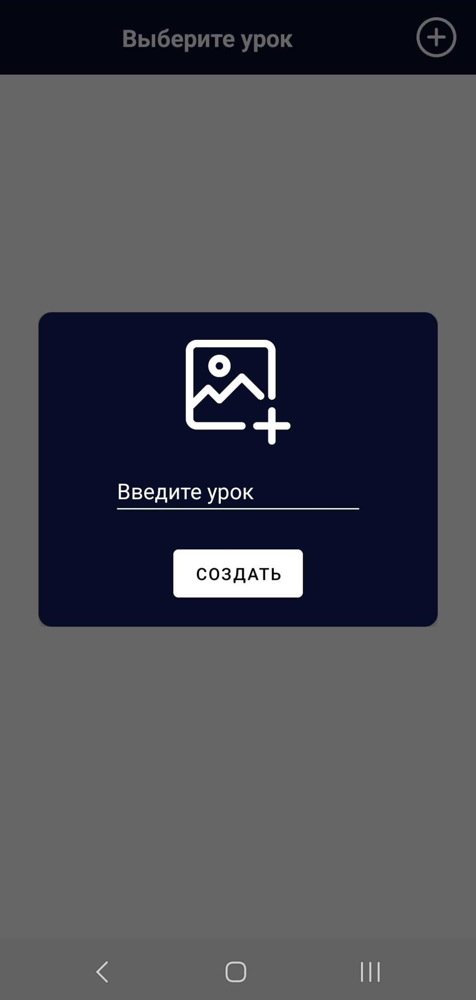
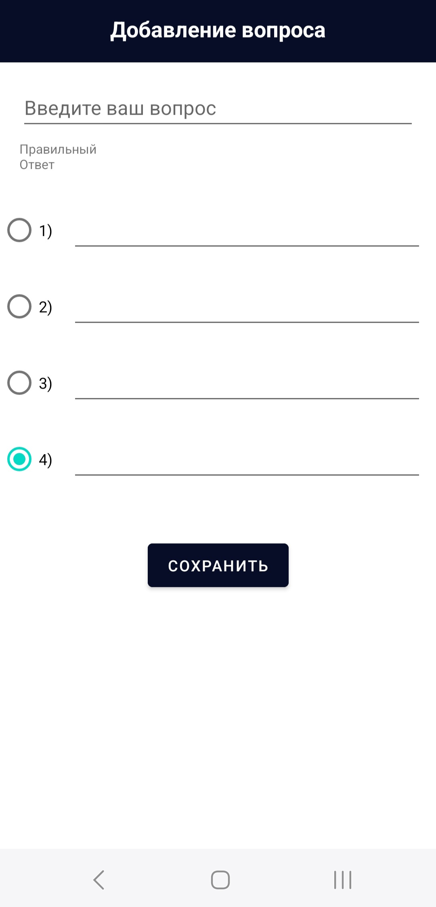
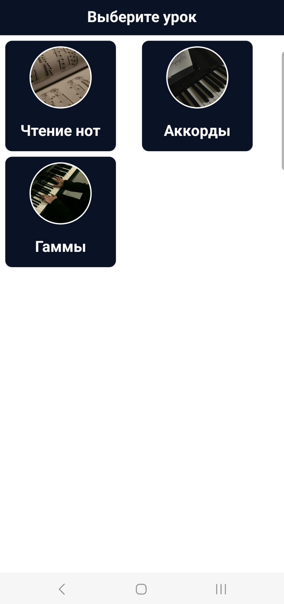
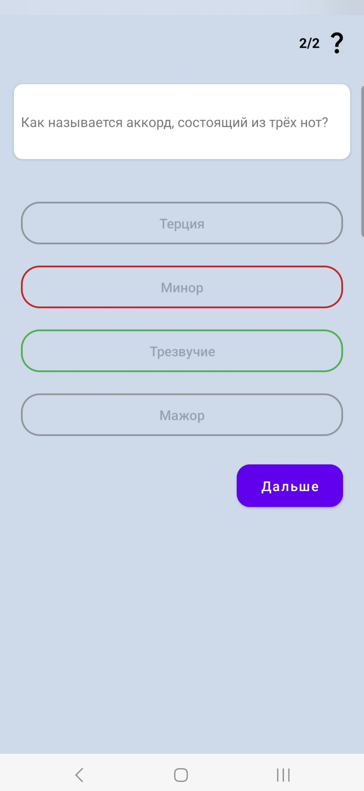
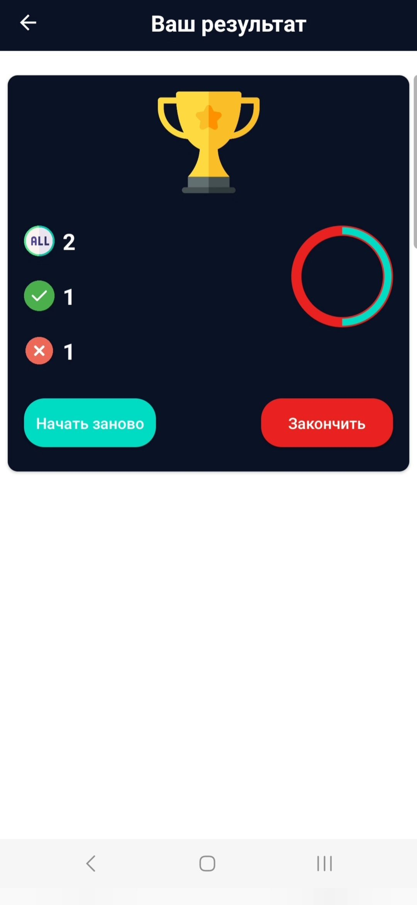

# Test app

## Description

This project is a university initiative, presenting a mobile testing application encompassing both user and administrative interfaces. The user interface empowers users to engage in tests across various categories, while the administrative interface provides administrators with the capability to manage questions and categories.

## Functionality

### User Interface

- Users can select tests from diverse categories.
- Users can undergo tests by responding to questions.
- Users can review their results upon test completion.

### Administrative Interface

- Administrators can create, modify, and delete categories.
- Administrators have the ability to create, modify, and delete questions within specific categories.

## Technologies

- Java for Android
- Firebase for data storage

---
    